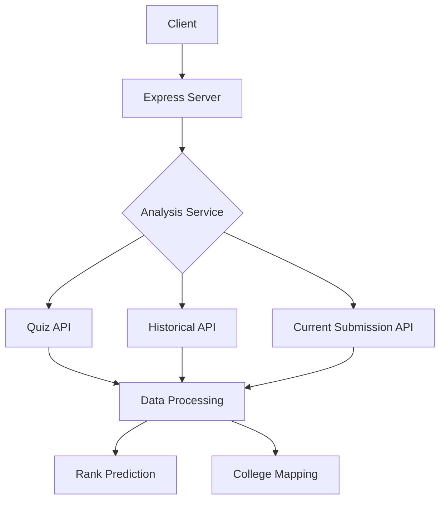

Here's a comprehensive README incorporating Docker setup, visualizations, and approach description:

# NEET Rank Predictor


A predictive analytics system that analyzes student quiz performance to predict NEET ranks and suggest potential medical colleges.

## 📋 Table of Contents

- [Features](#-features)
- [Tech Stack](#-tech-stack)
- [Architecture](#-architecture)
- [Setup](#-setup)
- [API Endpoints](#-api-endpoints)
- [Approach](#-approach)
- [Visualizations](#-visualizations)
- [Docker Support](#-docker-support)

## 🚀 Features

- Real-time performance analysis
- Weak area identification
- NEET rank prediction
- College admission suggestions
- Historical trend visualization
- Docker containerization

## 💻 Tech Stack


## 🏗 Architecture



## ⚙ Setup

### Prerequisites

- Docker 24.0+
- Node.js 18.x

### Docker Installation

```bash
# 1. Clone repository
git clone https://github.com/yourusername/neet-rank-predictor.git
cd neet-rank-predictor

# 2. Build Docker image
docker build -t neet-rank-predictor .

# 3. Run container
docker run -p 3000:3000 -d neet-rank-predictor

# 4. Verify running container
docker ps
```

## 🌐 API Endpoints

| Endpoint               | Method | Description              |
| ---------------------- | ------ | ------------------------ |
| `/api/analyze`         | GET    | Get performance analysis |
| `/api/predict-rank`    | GET    | Predict NEET rank        |
| `/api/colleges/{rank}` | GET    | Get college suggestions  |

**Sample Request:**

```bash
curl http://localhost:3000/api/analyze
```

## 🧠 Approach

### Data Pipeline

1. **Data Ingestion**:

   - Collect data from 3 external APIs
   - Handle rate limiting and retries
   - Data validation and sanitization

2. **Performance Analysis**:

   ```javascript
   const analyzePerformance = (submissions) => {
     // 1. Calculate topic accuracy
     // 2. Identify weak areas (accuracy < 65%)
     // 3. Generate trend data
     // 4. Calculate aggregate metrics
   };
   ```

3. **Rank Prediction**:

   ```javascript
   const predictRank = (avgScore) => {
     const avgScore = _.meanBy(submissions, 'score');
      return {rank:Math.round((720 - avgScore) * 1000 +1),
        avgScore
      };
   };
   ```

4. **College Prediction**:
   ```javascript
   function getColleges(rank) {
     return colleges.filter((c) => rank <= c.cutoff);
   }
   ```

## 📊 Visualizations

### 1. Performance Trend


- X-axis: Attempt dates
- Y-axis: Scores
- Line chart showing progress over time

### 2. Weak Areas


- Red: Accuracy < 65%
- Yellow: 65% ≤ Accuracy < 75%
- Green: Accuracy ≥ 75%

### 3. Rank Distribution


- Histogram showing predicted rank range
- Overlay with college cutoff markers

## 🐳 Docker Support

### Dockerfile

```dockerfile
FROM node:18-alpine

WORKDIR /app

COPY package*.json ./
RUN npm install

COPY . .

EXPOSE 3000
CMD ["node", "app.js"]
```

### Docker Commands Cheatsheet

| Command                          | Description           |
| -------------------------------- | --------------------- |
| `docker-compose build`           | Build services        |
| `docker-compose up`              | Start containers      |
| `docker logs <container>`        | View container logs   |
| `docker exec -it <container> sh` | Enter container shell |

## 🛠 Troubleshooting

**Common Issues:**

1. **API Connection Errors**:

   - Verify network connectivity
   - Check API endpoint availability

2. **Docker Build Failures**:

   ```bash
   # Clear Docker cache
   docker system prune -a

   # Rebuild with no cache
   docker build --no-cache -t neet-rank-predictor .
   ```

3. **Data Parsing Errors**:
   - Check API response formats
   - Validate data types in services

**Logs Inspection:**

```bash
docker logs <container_id> --tail 100 -f
```

---

📧 **Contact**: 22cs3064@rgipt.ac.in | 📄 [License MIT](LICENSE)
